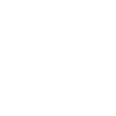

# fighter-advice

Inspired by Scott Tolinski and his [SvelteKit course](https://levelup.video/tutorials/sveltekit/), and being a Nak Muay (Thai Boxer), I'm attempting to build a application that will be helpful to other Nak Muay in their fighting journey.

## Tech ish

Uses [PayloadCMS](https://payloadcms.com). CMS API and Admin repo can [be found here](https://github.com/Barbacoa08/fighter-advice-cms).

## hosted via Netlify

[See it in action here](https://fighter-advice.barbajoe.tech/)
